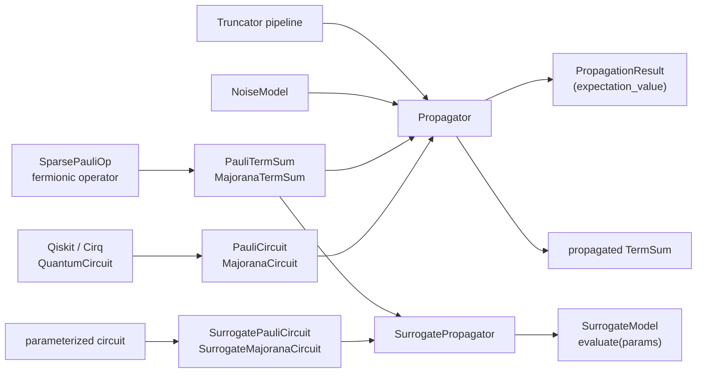

# Core concepts

## The Heisenberg picture

For a circuit \(C\), an observable \(
    \mathcal{O}\) and an initial state \(|\Psi_0\rangle\),
we often want to compute an expectation value:

\[
\mathbb{E}[\mathcal{O}] = \langle \Psi_0 | C^\dagger \mathcal{O}\, C | \Psi_0 \rangle = \mathrm{tr}(\mathcal{O} C\rho_0 C^\dagger)
\]

A state-vector, or density matrix simulator evolves \( \rho_0 = |\Psi_0\rangle \langle \Psi_0 |\) forward. The cyclicity of trace permits us to rewrite this as 

\[
\mathbb{E}[\mathcal{O}] = \mathrm{tr}(C^\dagger \mathcal{O} C\rho_0)
\]

i.e. we evolve the observable \(\mathcal{O}\) backward through the circuit, 
and compute the overlap with the intial state (usually a bitstring, or a Fock state in the fermionic case). This is the Heisenberg picture, and it is the basis of propaq's approach.

Unlike the Schrödinger picture where we require exponential space just to materialize the state vector, in the Heisenberg picture we only need to keep track of the observable, which is often sparse in the Pauli or Majorana basis, both of which are known to have compact bit representations due to their symplectic structure. The challenge is that non-Clifford gates cause the observable to branch into multiple terms during the backpropagation, so the number of terms grows exponentially, as one would expect from the classical simulation of a quantum circuit. Truncation and noise are the two mechanisms that propaq provides to manage this growth, and they are discussed in the [truncation guide](../guides/truncation.md) and the [noise guide](../guides/noise.md).
## Terms, term sums and branching

\(\Theta := C^\dagger \mathcal{O} C\) is represented as a term sum:

\[
\Theta = \sum_i c_i B_i \qquad c_i \in \mathbb{R}
\]

- In the Pauli basis, the terms are Pauli strings: [`PauliString`][propaq.datatypes.PauliString], collected into a [`PauliTermSum`][propaq.datatypes.PauliTermSum].
- In the Majorana basis, the terms are Majorana monomials: [`MajoranaMonomial`][propaq.datatypes.MajoranaMonomial], collected into a [`MajoranaTermSum`][propaq.datatypes.MajoranaTermSum].

Applying a gate rewrites every term. A Clifford gate maps one basis operator to
exactly one basis operator, so the term count is unchanged. A non-Clifford gate 
will, in general, induce branching: 

\[
\exp{(i \theta P)} : B_i \mapsto \cos(\theta) B_i + i \sin(\theta) T_i
\]

and as a result, over a deep circuit the number of terms will inevitably grow out of control.
Therefore, we need pruning mechanisms to keep the term count manageable.

**Merging** (lossless). Distinct branches frequently arrive at the same basis
operator, and their coefficients can simply be summed.

**Truncation** (lossy). Terms that are unlikely to matter are discarded, either by
operator weight, by coefficient magnitude, or by capping the total term count.
See the [truncation guide](../guides/truncation.md).

## Pauli versus Majorana

propaq propagates in either basis. They are related by the Jordan–Wigner
transform, but they are *not* equally efficient for the same problem.

| | Pauli | Majorana |
| --- | --- | --- |
| Basis elements | Pauli strings over \(n\) qubits | products of Majorana operators over \(2n\) modes |
| Natural for | qubit circuits, spin models, general ansätze | fermionic circuits (chemistry, Hubbard, UCJ ansätze) |
| Circuit type | [`PauliCircuit`][propaq.circuits.PauliCircuit] | [`MajoranaCircuit`][propaq.circuits.MajoranaCircuit] |
| Propagator | [`PauliPropagator`][propaq.propagators.PauliPropagator] | [`MajoranaPropagator`][propaq.propagators.MajoranaPropagator] |

[Notebook 02](../examples/usage/02_pauli_vs_majorana.ipynb) runs the same UCJ
ansatz both ways and compares them directly.

## Noise

A noise model damps terms as they propagate, which both models a noisy device
*and* accelerates the simulation by shrinking coefficients below the truncation
cutoff sooner. The built-in
[`UniformNoiseModel`][propaq.noise.UniformNoiseModel] is uniform-depolarizing noise, and scales a term of weight
\(w\) by \(e^{-\gamma w}\); you can also supply a Python model, or load a native
one written in C, Rust or Julia. See the [noise guide](../guides/noise.md).

## Surrogate (symbolic) propagation

If the circuit is *parameterized*, repeating the
whole propagation for every parameter assignment is wasteful, because the
branching structure does not depend on the parameter values, only the
coefficients do.

The surrogate propagators exploit this. They back-propagate once, keeping
each coefficient as a symbolic expression in the circuit parameters, and produce
a compiled [`PauliSurrogateModel`][propaq.models.PauliSurrogateModel] or
[`MajoranaSurrogateModel`][propaq.models.MajoranaSurrogateModel]. Evaluating that
model for a given parameter vector is a cheap calculation, and the
model can be saved to disk and reloaded. See the
[surrogate guide](../guides/surrogate.md).

!!! warning "Surrogate propagation is expensive."

    Surrogate propagation is more expensive than numerical propagation, since we 
    need to maintain symbolic coefficients, whose merge semantics are more restrictive.
    Additionally, this part of propaq is still under active development, and is subject to 
    change.

## The object model at a glance

