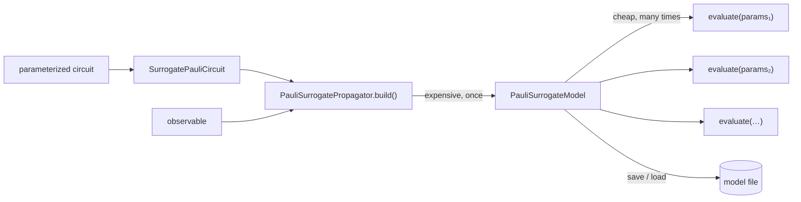

# Surrogate propagation

For a **parameterized** circuit, the branching structure of the back-propagated
observable does not depend on the parameter values, only the coefficients do.
The surrogate propagators propagate once, symbolically,
producing a compiled model whose evaluation for any parameter assignment is a
cheap calculation.

This is the right tool for variational workloads, parameter sweeps, and anything
where the same circuit topology is evaluated many times.



## Building a model

```python
from qiskit import QuantumCircuit
from qiskit.circuit import ParameterVector
from qiskit.quantum_info import SparsePauliOp

from propaq.circuits import SurrogatePauliCircuit
from propaq.datatypes import PauliTermSum
from propaq.propagators import PauliSurrogatePropagator

theta = ParameterVector("theta", 6)
qc = QuantumCircuit(3)
for i, q in enumerate([0, 1, 2, 0, 1, 2]):
    qc.rz(theta[i], q)

observable = PauliTermSum.from_sparse_pauli_op(
    SparsePauliOp.from_list([("ZZI", 1.0), ("IZZ", 1.0)])
)
circuit = SurrogatePauliCircuit.from_qiskit(qc)

model = PauliSurrogatePropagator().build(observable, circuit, initial_state=0)

print(model.n_terms, "terms /", model.n_monomials, "monomials")
print(model.evaluate([0.1] * 6))
```

[`build`][propaq._rust_core.PauliSurrogatePropagator.build] returns a
[`PauliSurrogateModel`][propaq.models.PauliSurrogateModel]. The Majorana
counterpart is [`MajoranaSurrogatePropagator`][propaq.propagators.MajoranaSurrogatePropagator]
producing a [`MajoranaSurrogateModel`][propaq.models.MajoranaSurrogateModel].

`evaluate` takes a flat sequence of floats, one per **surrogate parameter
slot**, which is not necessarily one per Qiskit `Parameter` (a single Qiskit
parameter can appear in several rotations, and a rotation angle can be a
`ParameterExpression`). Check `circuit.n_params` against `qc.num_parameters` to
see the difference.

## Variational models

[`VariationalSurrogateModel`][propaq.models.VariationalSurrogateModel] wraps a
compiled model together with the circuit's parameter mapping, so you can
evaluate it in terms of the Qiskit parameters directly. That makes it usable
as a cost function without any manual index bookkeeping:

```python
import numpy as np
from scipy.optimize import minimize

from propaq.models import VariationalSurrogateModel

variational_model = VariationalSurrogateModel(
    model,
    circuit.parameter_sources,
    circuit.qiskit_parameters,
)

rng = np.random.default_rng(42)
x0 = rng.uniform(-np.pi, np.pi, size=len(variational_model.parameters))

result = minimize(variational_model.evaluate, x0, method="COBYLA")
print("optimised cost:", result.fun)
```

`variational_model.parameters` gives the Qiskit `Parameter` objects in the order
`evaluate` expects, so binding the optimiser's result back into the original
circuit is a `dict(zip(...))`.

## Truncation in the surrogate

Surrogate builds accept the same truncator pipeline as numerical propagators,
plus two surrogate-only truncators:

| Truncator | Effect |
| --- | --- |
| [`FrequencyTruncator`][propaq.truncation.FrequencyTruncator] | drops paths that have branched more than `frequency` times |
| [`Simplify`][propaq.truncation.Simplify] | lossless: collapses monomials sharing a canonical path into one |

```python
from propaq.truncation import CoefficientTruncator, FrequencyTruncator, Simplify

prop = PauliSurrogatePropagator(
    truncation=[
        Simplify(),
        FrequencyTruncator(frequency=6),
        CoefficientTruncator(coefficient=1e-8),
    ]
)
```

The two axes to watch are terms and monomials (symbolic coefficients). Frequency truncator removes terms that have branched too many times.

## Persistence

Compiling is the expensive step, whereas evaluating is comparatively cheap. Save the model and reuse it:

```python
model.save("ansatz.surrogate")

# later, in a different process
from propaq.models import PauliSurrogateModel

model = PauliSurrogateModel.load("ansatz.surrogate")
print(model.evaluate(params))
```

Files are gzip-compressed binary. See
[Notebook 05](../examples/usage/05_surrogate_persistence.ipynb).

## When not to use a surrogate

If you only need one expectation value for one parameter assignment, the
numerical propagator is faster. You pay the symbolic build cost and get nothing
back for it. The surrogate wins once the number of evaluations is large enough
to amortize the build.

!!! warning "Surrogate models are not differentiable" 

    The surrogate models are currently incompatible 
    with autograd. We plan on implementing this in 
    the future.

## Worked examples

- [Notebook 04 - Variational quantum circuits](../examples/usage/04_variational_surrogate.ipynb)
- [Notebook 05 - Surrogate model persistence](../examples/usage/05_surrogate_persistence.ipynb)
